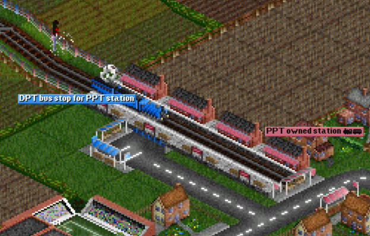

# Changes

## Table of contents

- 1.0) [Previous documentation](#10-previous-documentation)
- 2.0) [Features](#20-features)
    - 2.1) [Serving stations of other companies](#21-serving-stations-of-other-companies)
    - 2.2) [Sharing rail infrastructure](#22-sharing-rail-infrastructure)
	- 2.3) [Stations built by multiple companies](#23-stations-built-by-multiple-companies)
- 3.0) [Known issues](#30-known-issues)
    
## 1.0) Previous documentation

The changes were first documented in [*change_references.txt*](change_references.txt) 
and [*changes.txt*](changes.txt) files.

[*change_references.txt*](change_references.txt)  describes which lines of code 
were modified for each source file
[*changes.txt*](changes.txt) describes the avaliable features, the known bugs 
(and if they were fixed), and the use-cases that were not tested. This file 
explains the changes in a confusing way, so I suggest to read the 
documentation below documentation first and then see the file.

Update for the file [*changes.txt*](changes.txt): I tested the boats use case. 
It works, exept when the  [known issues](#30-known-issues) occurr.

## 2.0) Features

In this section I will describe and give a demonstration of the features.

All the demonstrations were performed using the [*sample.sav*](Changes/sample.sav) 
savegame.

*PPT* and *DPT* are the names I assigned to the companies created for the demonstrations.

### 2.1) Serving stations of other companies

Companies can serve stations owned by other companies.

This can be done with all types of vehicles and only for stations. Using other 
destinations such as depots will not be possible, even if it is accepted as a 
valid destination. 

### 2.2) Sharing rail infrastructure

Companies can create a rail network where a train owned by a company can use 
tracks owned by other companies.

### 2.3) Stations built by multiple companies

Stations can be built and later expanded by other companies.

Example: DPT builds a bus station that PTP can later expand 
by adding a train station to it.

## 3.0) Known issues

The previously described features are not bug-free.

Here a list of the known issues, including the year of when it was found:

- (2019) Pathfinding does not work correctly on shared rail infrastructured when
rail tiles of the found path are owned by multiple companies. This bug leads to 
train crashes.

- (2024) Ownership conflicts for stations with tiles owned by multiple companies,
that leads to issues like not being able to demolish an owned tile of a station 
owned by a different company. This is because a station was originally intended to
be owned, in it's entirety, by only one company.

- (2024) Companies can edit signs of other companies, with recoloring, 
as a possible conseguence of ownership change, of the sign after saving the edit

- (2024) Rail infrastructure ownership issue when building a diagonal rail: a company
cannot build into an half empty tile of another company. Note that this is not a bug, 
but a limitation of the game because in the original game a tile is intended to 
be fully owned by one company.

- (2024) In vehicle orders some destination that are not stations, even if unccessible
because of ownership conflicts, are considered valid. This causes the vehicle to
enter in a loop where it tries to enter in a tile it cannot step into.

